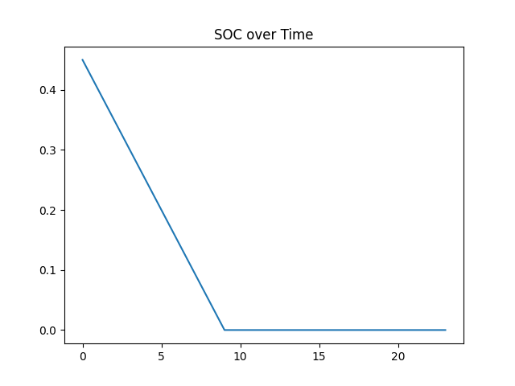
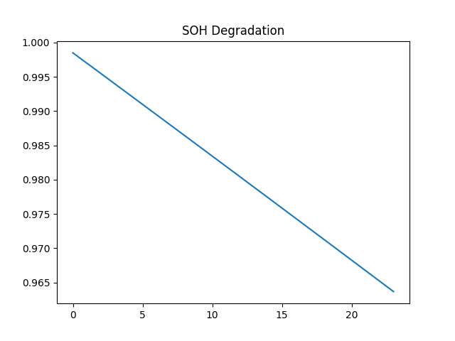
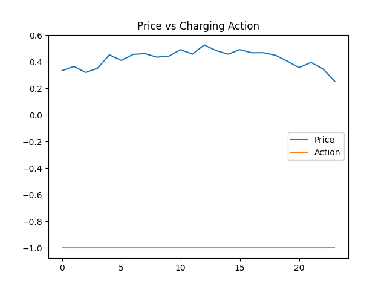

# 🔋 AI-Driven Health-Aware EV Charging using Reinforcement Learning

## 📌 Overview

This project formulates Electric Vehicle (EV) charging as a sequential decision-making problem and solves it using Proximal Policy Optimization (PPO).

The objective is to optimize charging/discharging decisions while balancing:

- ⚡ Economic profit (time-of-use pricing)
- 🔋 Battery degradation (State of Health - SOH)
- 🛡 Safety-aware State of Charge (SOC) constraints

The system integrates reinforcement learning with a physics-inspired battery degradation model to achieve multi-objective optimization.

---

## 🧠 Problem Formulation

The EV charging problem is modeled as a Markov Decision Process (MDP).

### 🔹 State Space

The environment state consists of:

- State of Charge (SOC)
- State of Health (SOH)
- Electricity Price
- Remaining Time

### 🔹 Action Space

Continuous charging/discharging power:

Action ∈ [-1, 1]

- -1 → Full discharge
- 0 → Idle
- +1 → Full charge

### 🔹 Reward Function

The reward balances multiple objectives:

Reward = Profit − Degradation Penalty − SOC Stability Penalty

Where:

- Profit = −(action × price)
- Degradation = nonlinear physics-inspired model
- SOC Penalty = encourages SOC stability around 50%

Additionally, hard SOC safety constraints prevent unrealistic battery behavior.

---

## ⚙️ Technologies Used

- Python
- Gymnasium
- Stable-Baselines3 (PPO)
- PyTorch
- NumPy
- Matplotlib

---

## 📈 Training Performance

The PPO agent demonstrates stable learning behavior.

Training reward improved from:

- Initial: **-7.49**
- Final: **-0.98**

This indicates effective convergence of the reinforcement learning agent under multi-objective constraints.

---

## 📊 Results & Visualization

### 1️⃣ State of Charge (SOC) Behavior

The agent maintains SOC within safe limits due to hard constraints and reward shaping.

---

### 2️⃣ State of Health (SOH) Degradation

The nonlinear degradation model results in gradual SOH decline, demonstrating realistic battery aging behavior.

---

### 3️⃣ Price vs Charging Action

The agent adapts its charging/discharging decisions based on dynamic electricity pricing.

---

## 🏆 Key Contributions

- Custom Gym-based EV charging environment
- Nonlinear battery degradation modeling
- Multi-objective reward engineering
- Safety-aware SOC constraint implementation
- PPO-based continuous control optimization
- Convergence analysis with performance logs

---

## 🚀 Future Improvements

- Incorporating real-world battery datasets (e.g., NASA battery data)
- Safe Reinforcement Learning (Constrained PPO)
- Multi-agent EV fleet optimization
- Integration with smart grid demand response

---

## 🎯 Conclusion

This project demonstrates how reinforcement learning can be applied to intelligent EV charging systems by combining economic optimization with battery health preservation.

The results highlight the importance of reward shaping and constraint modeling in real-world energy optimization problems.
